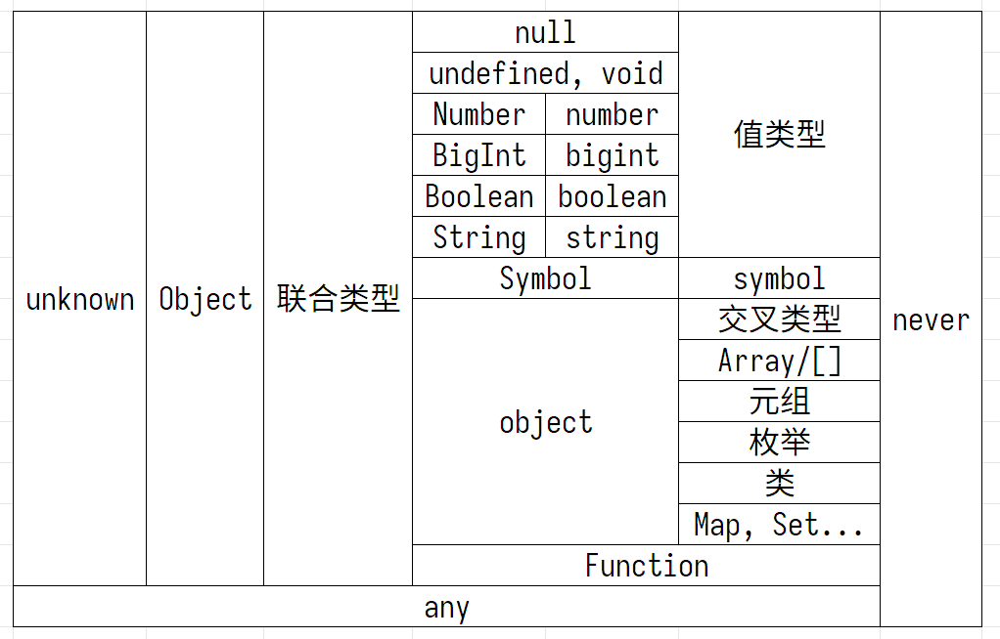

# TypeScript
## 大纲
- `tsconfig.json`
- 基础类型介绍
  - 基本类型 与包装类型
  - 值类型
  - `unknown 与 any`
- `type 与 interface`
- 复合类型
  - `Object 与 object`
  - 联合类型与交叉类型
  - 数组与元组
  - 枚举
  - 函数类型
  - `never, void 与 undefined`
  - 类
- `Typescript` 深入
  - 类型断言
  - 模块
  - 命名空间
  - 装饰器
  - `declare`
  - `d.ts`

## 类型可视化
- 左侧类型的变量一定可以包含右侧类型的变量, 反之不一定.
